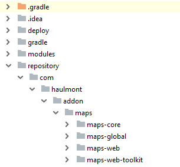
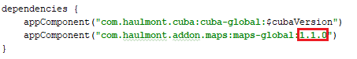
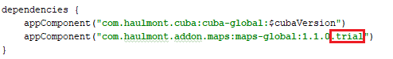

# CUBA Petclinic: Maps

<p align="center">
  
</p>

This is a variation of [CUBA Petclinic](https://github.com/cuba-platform/cuba-petclinic) application working with the [CUBA Maps add-on](https://www.cuba-platform.com/marketplace/maps/).

## Domain model


## Starting the application

#### start database
```
./start-db.sh
```

#### start application
```
./restart-server.sh
```

## Populating the application with the data

To see the nice view on maps in the application, you need to import the predefined data to it.

 * Find `import1.groovy` and `import2.groovy` scripts in the `/data` folder.

 * Put them into `conf/petclinic-core` folder on your application server.

 * In the application go to `Administration -> JMX Console`. Find `ScriptingManager` JMX bean.

 * Run `import1.groovy` script and then `import2.groovy` script.

 ## How to Install the Maps Add-on Trial Version

 You can get trial subscription from [CUBA Marketplace](https://www.cuba-platform.com/marketplace/maps/) to run this application on your local environment. After getting trial subscription you'll receive an email with a link for downloading ZIP archive with artifacts.

 To install the trial version of Maps add-on:

 1. Get trial subscription from [CUBA Marketplace](https://www.cuba-platform.com/marketplace/maps/). You'll get an email with a link and instructions.

 2. Download ZIP archive with artifacts at link from the email.

 3. Clone the repository of this demo project.

 4. Open demo project in CUBA Studio.

 5. Create a directory called `repository` in the root directory of the demo project.

 6. Unzip the file with artifacts into this directory. You should get the following directory structure:

  

 7. Open `build.gradle` file and register a new Maven repository.
  ```
  maven {
      url './repository'
  }
  ```
   

 8. Find a string with add-on coordinates and replace the add-on version with the latest one. Check the latest version on [CUBA Marketplace](https://www.cuba-platform.com/marketplace/maps/).

  

 9. Then add `.trial` to the end of add-on coordinates.

  

 10. Go to *CUBA -> Build Tasks -> Deploy* to check that the add-on was installed successfully.     
